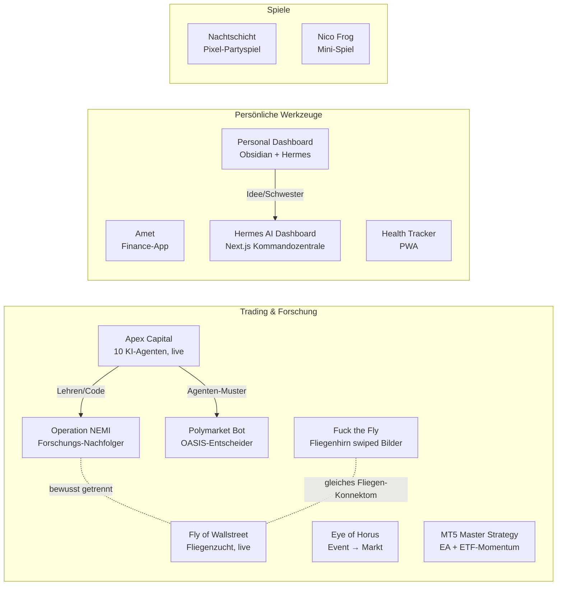

# projects

Die Landkarte aller meiner Projekte und Repos: was es gibt, wie es zusammenhängt,
was funktioniert hat, was nicht — und was du davon für deine eigenen Projekte
mitnehmen kannst.

> **Lesehilfe:** Wer nur Ideen und Muster will, springt direkt zu
> [LERNEN.md](LERNEN.md) (Lektionen), [BAUSTEINE.md](BAUSTEINE.md) (Rezepte zum
> Abschreiben) oder [IDEEN.md](IDEEN.md) (Brainstorm, was als Nächstes kommt).

---

## Die Karte

*Durchgezogen = ein Projekt ist aus dem anderen entstanden, gestrichelt = verwandt.*

---

## Übersicht

| Projekt | Worum geht's | Stack | Stand | Repo |
|---|---|---|---|---|
| [Apex Capital](projekte/apex-capital.md) | 10 KI-Agenten mit Persönlichkeit recherchieren, debattieren und handeln (Papiergeld) | Python, FastAPI, Docker, Railway | **läuft live** | [Apex-Capital](https://github.com/Nikros07/Apex-Capital) |
| [Operation NEMI](projekte/operation-nemi.md) | Quant-Forschung mit „NO TRADE als Standard" — Nachfolger von Apex | Python 3.11, Backtester, Railway-Cron | Backtest: **nicht profitabel**, kein Kapital | [Operation-NEMI](https://github.com/Nikros07/Operation-NEMI) |
| [Fly of Wallstreet](projekte/fly-of-wallstreet.md) | Künstliche Fruchtfliegen (Pilzkörper + Dopamin) lernen Trading, Wochen-Evolution | Python, NumPy, GitHub Actions | **läuft live**, kein belegter Vorsprung | [Fly-of-Wallstreet](https://github.com/Nikros07/Fly-of-Wallstreet) |
| [Fuck the Fly](projekte/fuck-the-fly.md) | Echtes Fliegenhirn (166.700 Neuronen) swiped Bilder links/rechts | Python, `flybrain` | Spielerei, fertig | [Fuck-the-Fly](https://github.com/Nikros07/Fuck-the-Fly) |
| [Eye of Horus](projekte/eye-of-horus.md) | Von realen Ereignissen zu Marktwirkung, mit erzwungener Look-ahead-Freiheit | FastAPI, Next.js 16, React Three Fiber | Demo-Modus komplett, Live-Anbindung vorbereitet | [Eye-of-Horus](https://github.com/Nikros07/Eye-of-Horus) |
| [Polymarket Bot](projekte/polymarket-bot.md) | 10-Agenten-„OASIS"-Entscheider für Wetten und Prognosemärkte | Python, Streamlit, FastAPI | ruht seit April | [Polymarket-Bot](https://github.com/Nikros07/Polymarket-Bot) |
| [MT5 Master Strategy](projekte/mt5-master-strategy.md) | Forex-EA (v7) + ETF-Momentum-Portfolio (v4), gegen DAX/S&P gemessen | MQL5, Python | v7 kompiliert, Testlauf offen | lokal im Vault |
| [Amet](projekte/amet.md) | Privates Finance-Cockpit mit Wallets, Budgets, Sparzielen, KI-Assistent | Vanilla-JS, Supabase | Phasen A–D fertig | [Amet](https://github.com/Nikros07/Amet) |
| [Personal Dashboard](projekte/personal-dashboard.md) | Lokales Dashboard: Obsidian-Sync, Hermes-Agenten, Aufgaben, Monitoring | React/Vite, Fastify, SQLite | Gerüst/Prototyp | [Personal-Dashboard](https://github.com/Nikros07/Personal-Dashboard) |
| [Hermes AI Dashboard](projekte/hermes-ai-dashboard.md) | Apple-inspirierte KI-Kommandozentrale mit Widget-Board | Next.js, Tailwind, Framer Motion | läuft mit Demo-Daten, noch ohne Remote | lokal (noch kein Repo) |
| [Nachtschicht](projekte/nachtschicht.md) | Pixel-Art-Partyspiel im Browser, 8 Level, ohne Build | Vanilla-JS, GitHub Pages | **spielbar**, Nachtroutinen in Vorbereitung | [Nachtschicht](https://github.com/Nikros07/Nachtschicht) · [▶ spielen](https://nikros07.github.io/Nachtschicht/) |
| [Health Tracker](projekte/health-tracker.md) | Installierbare PWA zum Mitzählen von Konsum | HTML/JS, Service Worker | klein, fertig | [Health-Tracker](https://github.com/Nikros07/Health-Tracker) |
| [Nico Frog](projekte/nico-frog.md) | Ein-Datei-Browserspiel | HTML (eine Datei) | klein, fertig | [Nico-Frog](https://github.com/Nikros07/Nico-Frog) |

Dazu das Umfeld: [Werkzeuge & fremder Code](projekte/umfeld.md) (Flipper-Firmware,
Security-Tools, Zubehör) — **nicht** von mir geschrieben, aber nützlich zu wissen.

---

## Die rote Fäden

1. **Ehrlichkeit vor Rendite.** Fast jedes Trading-Projekt hat gelernt, dass die
   erste gute Zahl meist ein Messfehler ist. Aus diesen Fehlern ist eine
   Arbeitsweise geworden → [LERNEN.md](LERNEN.md).
2. **NO TRADE ist ein gültiges Ergebnis.** Seit Apex Capital zu Trades gezwungen
   wurde, ist „nichts tun" in jedem neueren Projekt der Ruhezustand.
3. **Wenig Betrieb, wenig Kosten.** Cron statt Dauerbetrieb, GitHub Actions statt
   Server, ein Branch als Datenbank → [BAUSTEINE.md](BAUSTEINE.md).
4. **KI als Beiwerk, nicht als Rechner.** Alles, was Kapital berührt, rechnet
   deterministischer Code. Sprachmodelle erklären, fassen zusammen, widersprechen.
5. **Nachts arbeiten lassen.** Nachtschicht probiert aus, wie ein Projekt sich mit
   einer Warteschlange und Cloud-Routinen selbst weiterbaut.

---

## Wie du das für deine Projekte nutzt

- **Du baust ein Trading- oder Prognosesystem?** Lies zuerst
  [LERNEN.md](LERNEN.md) — es spart dir die Fehler, die hier schon gemacht wurden
  (Look-ahead, In-Sample-Täuschung, erzwungene Trades, Kosten).
- **Du willst etwas billig und dauerhaft betreiben?** → [BAUSTEINE.md](BAUSTEINE.md),
  Rezepte „Cron auf GitHub Actions" und „Zustand auf eigenem Branch".
- **Du willst eine KI nachts an einem Projekt weiterarbeiten lassen?** →
  [Nachtschicht](projekte/nachtschicht.md) und der Baustein „Nacht-Warteschlange".
- **Du suchst Ideen?** → [IDEEN.md](IDEEN.md).

Jeder Steckbrief in [projekte/](projekte/) hat einen Abschnitt **„Das kannst du
mitnehmen"** — das ist der Teil, der auch ohne Kontext funktioniert.

---

## Zur Pflege dieser Seite

- Quelle der Wahrheit ist das jeweilige Repo; hier stehen Zusammenfassungen. Bei
  Widerspruch gilt das Repo.
- Stand dieser Übersicht: **2026-10-01**. Zahlen (Sharpe, Renditen) sind
  Momentaufnahmen aus den jeweiligen Berichten, keine Anlageberatung.
- Keine Zugangsdaten, Schlüssel oder private Kontostände gehören hierher.
- Neues Projekt: Steckbrief nach Vorlage in [projekte/_VORLAGE.md](projekte/_VORLAGE.md)
  anlegen, Zeile in die Tabelle, Knoten in die Karte.

*Nichts hier ist Anlageberatung. Papierkonto ist Papierkonto.*
