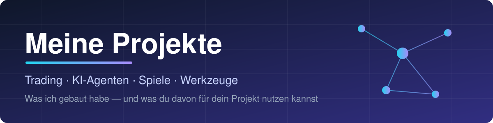
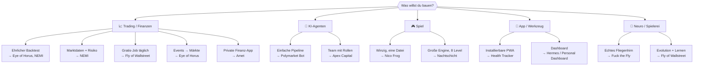
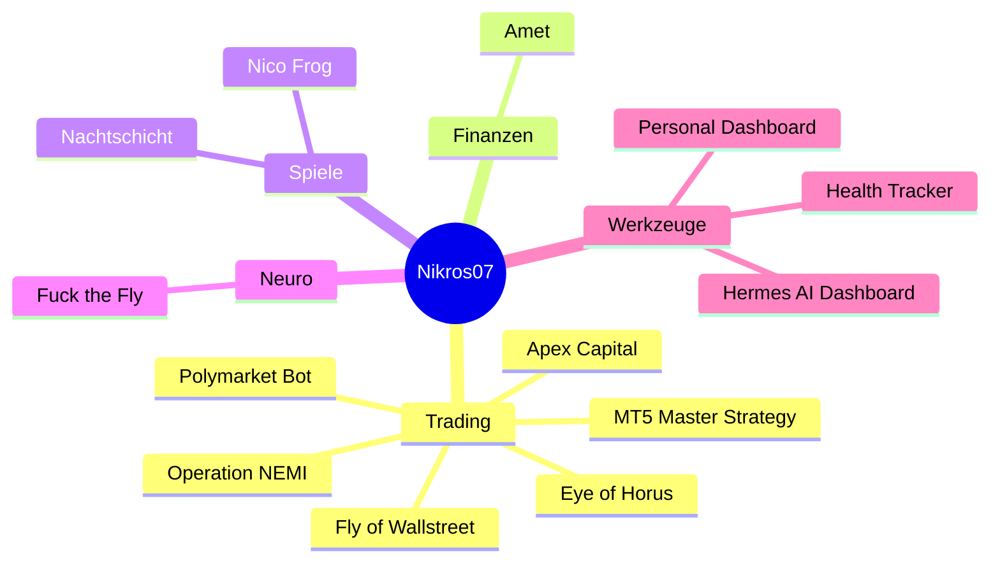
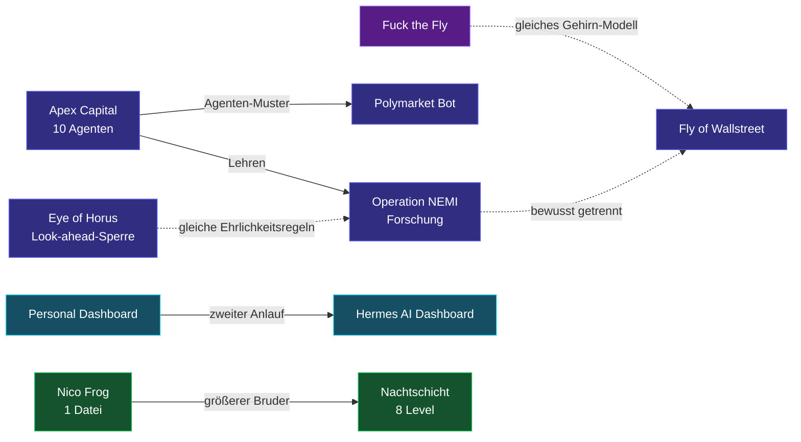
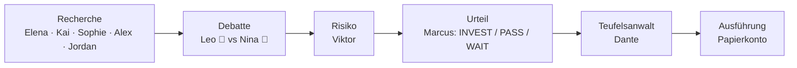
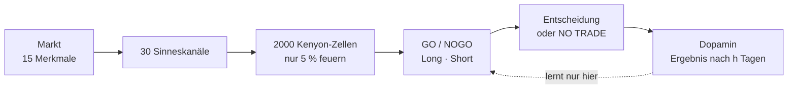
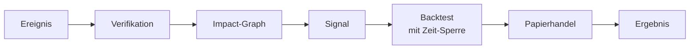
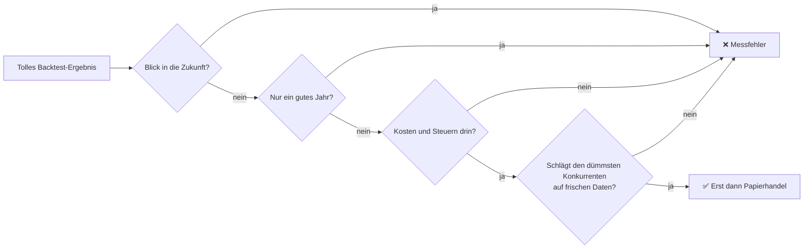

 

**Du willst etwas Ähnliches bauen? Such dein Ziel unten aus und nimm dir nur den Teil, den du brauchst.**

[Finde dein Projekt](#-finde-dein-projekt) ·
[Alle Projekte](#-alle-projekte-auf-einen-blick) ·
[Details](#-die-projekte-im-detail) ·
[Gelerntes](#-was-ich-gelernt-habe) ·
[Für Agents](#-für-ai-agents)

---

## 🧭 Finde dein Projekt

---

## 🗺️ Alle Projekte auf einen Blick

### Wie die Projekte zusammenhängen

### Die Tabelle

| | Projekt | Worum geht's | Stand | Repo |
|:-:|---|---|:-:|:-:|
| 📈 | **Apex Capital** | 10 KI-Agenten debattieren und handeln (Papier) | 🟢 live | [↗](https://github.com/Nikros07/Apex-Capital) |
| 📈 | **Operation NEMI** | Quant-Forschung, „NO TRADE" als Standard | 🔴 Backtest negativ | [↗](https://github.com/Nikros07/Operation-NEMI) |
| 📈 | **Fly of Wallstreet** | Fliegengehirn lernt Trading, Wochen-Evolution | 🟡 live, kein Vorsprung | [↗](https://github.com/Nikros07/Fly-of-Wallstreet) |
| 📈 | **Eye of Horus** | Ereignis → Markt, mit Look-ahead-Sperre | 🟢 Demo komplett | [↗](https://github.com/Nikros07/Eye-of-Horus) |
| 📈 | **Polymarket Bot** | Entscheider für Prognosemärkte | ⚪ ruht | [↗](https://github.com/Nikros07/Polymarket-Bot) |
| 📈 | **MT5 Master Strategy** | Forex-Robot + ETF-Portfolio | 🟡 v7 ungetestet | lokal |
| 💶 | **Amet** | Private Finanz-App (Supabase) | 🟢 nutzbar | [↗](https://github.com/Nikros07/Amet) |
| 🎮 | **Nachtschicht** | Pixel-Partyspiel, 8 Level | 🟢 [▶ spielbar](https://nikros07.github.io/Nachtschicht/) | [↗](https://github.com/Nikros07/Nachtschicht) |
| 🎮 | **Nico Frog** | Mini-Spiel in einer Datei | 🟢 fertig | [↗](https://github.com/Nikros07/Nico-Frog) |
| 🧠 | **Fuck the Fly** | Echtes Fliegenhirn swiped Bilder | 🟢 fertig | [↗](https://github.com/Nikros07/Fuck-the-Fly) |
| 🧰 | **Personal Dashboard** | Obsidian + Aufgaben + Suche | 🟡 Prototyp | [↗](https://github.com/Nikros07/Personal-Dashboard) |
| 🧰 | **Hermes AI Dashboard** | Widget-Kommandozentrale | 🟡 lokal | lokal |
| 🧰 | **Health Tracker** | Installierbare Tracker-PWA | 🟢 fertig | [↗](https://github.com/Nikros07/Health-Tracker) |

🟢 läuft/fertig · 🟡 Prototyp oder ohne Beleg · 🔴 Ergebnis negativ · ⚪ ruht

---

## 🔍 Die Projekte im Detail

Aufklappen, was dich interessiert. **„Nimm"** nennt Ordner/Dateien, die du direkt mitnehmen kannst.

### 📈 Trading & Finanzen

<b>Apex Capital</b> — 10 KI-Agenten debattieren Aktien · 🟢 live

 

Python, FastAPI, Docker, Railway · nur Papiergeld · [Repo](https://github.com/Nikros07/Apex-Capital)

**Nimm:** `agents/` (Rollen-Agenten), `core/scheduler.py`.
**Vorsicht:** Enthielt erzwungene Trade-Pfade. Das ist ein Anti-Muster, nicht übernehmen.

<b>Operation NEMI</b> — Forschung mit „NO TRADE" als Standard · 🔴 Backtest negativ

 

Python 3.11 · Railway-Cron · [Repo](https://github.com/Nikros07/Operation-NEMI)

Erster Echtdaten-Backtest (7,7 Jahre, 161 Symbole): **nicht profitabel**. Der Gewinn kam allein aus 2020, Walk-forward hat auch das beste Setup widerlegt. Das ist dokumentiert statt versteckt.

**Nimm:** `nemi/backtest/` (Walk-forward, Monte Carlo) · `nemi/data/` (Yahoo-Sammler) · `nemi/risk/` (Positionsgröße, Stops) · `nemi/engine/regime.py`.

<b>Fly of Wallstreet</b> — Fliegengehirn lernt Trading · 🟡 live, kein Vorsprung

 

Python, NumPy, GitHub Actions · [Repo](https://github.com/Nikros07/Fly-of-Wallstreet)

50 Fliegen, jede Woche sterben 10 % und 10 % werden geklont. Ergebnis 2000–2024: Sharpe **0,44** (Kolonie) vs. 0,41 (Kontrolle) vs. 0,48 (SPY): kein belastbarer Vorsprung.

**Nimm:** `.github/workflows/daily.yml` (kostenloser Tagesjob mit Zustand auf eigenem Branch) · `fly/evolution.py` · `fly/broker.py` (nur Papierkonto).

<b>Eye of Horus</b> — Ereignis → Markt · 🟢 Demo komplett

 

FastAPI, Next.js 16, 3D-Globus · [Repo](https://github.com/Nikros07/Eye-of-Horus)

**Nimm:** `backend/app/services/quant_engine/` (Backtester, der Zukunftsdaten verweigert) · `event_engine/` (NASA EONET, Open-Meteo) · `impact_engine/`.
**Vorsicht:** Demo-Daten sind mit `is_demo` markiert und enthalten künstlichen Drift.

<b>Polymarket Bot</b> — Entscheider für Wetten und Prognosemärkte · ⚪ ruht

 

Python, Streamlit, FastAPI · [Repo](https://github.com/Nikros07/Polymarket-Bot)

Sieben Stufen mit zehn Agenten (Scanner → Recherche → Predictor/Analyst/Skeptiker → Szenarien → Validierung → Synthese → Scoring). Läuft kostenlos mit OpenRouter oder ganz ohne Schlüssel im Demo-Modus.

**Nimm:** `backend/agents/` (inkl. `skeptic_agent.py`), `backend/core/orchestrator.py`.

<b>MT5 Master Strategy</b> — Forex-Robot + ETF-Portfolio · 🟡 lokal

 

MQL5, Python · kein Repo

Der Forex-Robot v6 hatte vor Kosten exakt null Vorteil, deshalb v7 mit 13 Märkten auf Tagesbasis. Das ETF-Portfolio schlägt den DAX nach Steuer, aber **nicht** S&P-Buy-and-Hold (10,02 % vs. 10,56 % p. a.). Der echte Vorteil ist weniger Drawdown (−19 % statt −25 %).

**Lehre:** Kosten zuerst messen, immer gegen den dümmsten Konkurrenten vergleichen.

<b>Amet</b> — private Finanz-App · 🟢 nutzbar

 

Vanilla-JS, Supabase, GitHub Pages · [Repo](https://github.com/Nikros07/Amet)

Wallets, Budgets, Sparziele, Forecast, KI-Assistent. Kein Bankzugriff, alles manuell, kein Wallet kann ins Minus.

**Nimm:** `supabase/` (Schema, Migrationen, Row-Level-Security) · `js/` (Wallets, Budgets, Ziele, Schnelleingabe).

### 🎮 Spiele

<b>Nachtschicht</b> — Pixel-Partyspiel · 🟢 <a href="https://nikros07.github.io/Nachtschicht/">spielbar</a>

 

Vanilla-JS, Canvas, 8 Level, Touch-Steuerung · [Repo](https://github.com/Nikros07/Nachtschicht)

Schule → Bei Moritz → Nachtbus → Schlange → Club → Afterhour → Späti → Heimweg.

**Nimm:** `nacht/` (Engine: Welt, Kampf, Dialoge, Ton, Eingabe, Mobil) · `ARCHITEKTUR.md` (Karte des Codes).

<b>Nico Frog</b> — Mini-Spiel in einer Datei · 🟢

 

[Repo](https://github.com/Nikros07/Nico-Frog) · **Nimm:** `index.html`, das ist das ganze Spiel.

### 🧠 Neuro-Spielerei

<b>Fuck the Fly</b> — echtes Fliegenhirn swiped Bilder · 🟢

 

Python, `pip install flybrain` · [Repo](https://github.com/Nikros07/Fuck-the-Fly)

166.700 echte Neuronen entscheiden per Balz- oder Fluchtreflex-Schaltkreis, ob ein Bild links oder rechts landet. Lädt beim ersten Start ca. 260 MB.

**Nimm:** `fly_tinder.py` als Einstieg in Konnektom-Daten.

### 🧰 Werkzeuge

<b>Personal Dashboard</b> · 🟡 Prototyp

 

React/Vite/Tailwind + Fastify + SQLite · [Repo](https://github.com/Nikros07/Personal-Dashboard)

Obsidian-Sync, Aufgaben, Volltextsuche (SQLite FTS5), System-Monitoring. **Nimm:** `backend/` und `frontend/` als Gerüst.

<b>Hermes AI Dashboard</b> · 🟡 lokal, noch ohne Repo

 

Next.js, Tailwind, Framer Motion · Widget-Board mit Drag-and-Drop, Strg+K-Suche, Demo-Daten ohne Schlüssel.

<b>Health Tracker</b> — installierbare PWA · 🟢

 

HTML/JS · [Repo](https://github.com/Nikros07/Health-Tracker)

**Nimm:** `manifest.json` + `sw.js` als Minimal-Vorlage für „App aufs Handy installieren".
**Vorsicht:** `js/github-storage.js` speichert Daten im öffentlichen Repo, für private Daten nicht übernehmen.

---

## 🎓 Was ich gelernt habe

1. **Nichts tun ist ein gültiges Ergebnis.** Kein Pfad darf einen Trade erzwingen.
2. **Der Code rechnet, die KI redet.** Alles, was Geld berührt, ist normaler, testbarer Code.
3. **Widerspruch einbauen.** Ein Skeptiker, der widersprechen *muss*, schlägt freundliche Agenten.
4. **Ehrlich messen:** Walk-forward statt Auswahldaten, frische Seeds, Kosten zuerst.
5. **Billig betreiben:** Cron statt Dauerbetrieb, GitHub Actions statt Server, Zustand auf eigenem Branch.

---

## 🤖 Für AI-Agents

Dieses Repo ist auch für Agents gebaut:

- [`projects.json`](projects.json): strukturierter Index (Tags, Status, wiederverwendbare Pfade, Vorsichtshinweise)
- [`AGENTS.md`](AGENTS.md): Vorgehen, Entscheidungstabelle und Regeln (keine Schlüssel, nur Papierhandel, Pfade vor dem Empfehlen prüfen)

---

Wenn du etwas verwendest, verlinke kurz dieses Repo: **https://github.com/Nikros07/Projects** · [CC BY 4.0](LICENSE)

Stand 2026-10-01 · Keine Anlageberatung · Vieles ist Prototyp

